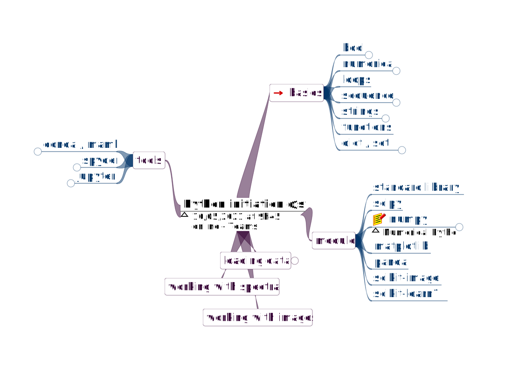

# svi_python_initiation
Support for the _scientific python initiation @svi course_

[</img>](#logo)

## Things to do before we begin:

### 1. Create a new conda environment on your computer
* Open the Anaconda prompt.  
* type `conda create -n svi_formation python=3.9`, (press enter to run the command)  
* then type `conda activate svi_formation`  
  * optionnally: `conda install -c conda-forge mamba`  
* then*: `conda install scipy numpy matplotlib scikit-image scikit-learn spyder jupyterlab ipympl`  
  * *if you decided to install mamba, replace `conda` with `mamba` in previous line.  

### 2. Download the material for this course (everything in this repository)
Click on the (only) green button on this page and select the download option of your choosing. (don't worry, you can't break anything)

### 3. Take a look at the basic topics we planned to cover

[</img>](#plan)

All suggestions for additionnal topics are welcomed!  
To submit your proposals, you can either use the Teams channel, either open an issue here (a-ha!). (the most voted ones are sure to enter the program)

_Note_ : Almost **Everything** we'll do here is covered in [scipy-lectures](https://scipy-lectures.org/), only much better and by way much greater experts in the field.
